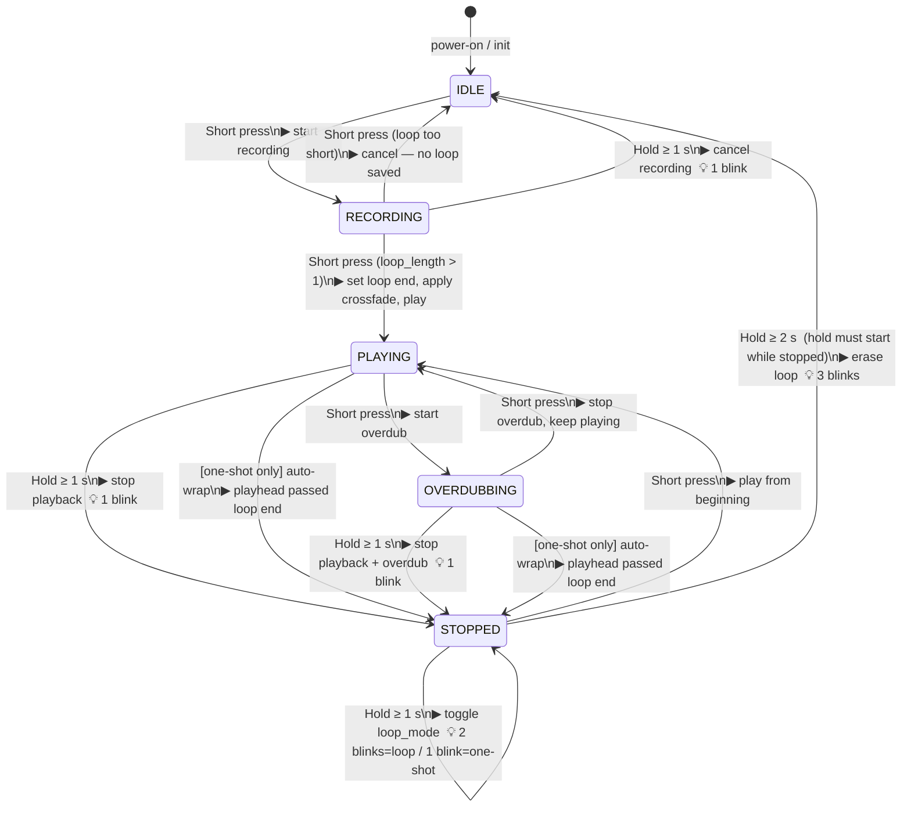

# Dual Looper — Footswitch State Machine

Both footswitches are identical; each independently controls its own looper.
All timing constants are defined at the top of `dual_looper.cpp`:

| Constant    | Value     | Meaning                              |
|-------------|-----------|--------------------------------------|
| `MODE_MS`   | 1000 ms   | Hold threshold → ModePress           |
| `ERASE_MS`  | 2000 ms   | Hold threshold → ErasePress          |
| `XFADE_LEN` | 128 samp  | Crossfade length at loop splice      |

---

## State Diagram



---

## State Definitions

| State          | `has_loop` | `playing` | `recording` | Notes                              |
|----------------|:----------:|:---------:|:-----------:|------------------------------------|
| **IDLE**       | false      | false     | false       | No content; awaiting first press   |
| **RECORDING**  | false      | false     | true        | Capturing initial loop             |
| **PLAYING**    | true       | true      | false       | Looping or one-shot playback       |
| **OVERDUBBING**| true       | true      | true        | Playing + mixing new input in      |
| **STOPPED**    | true       | false     | false       | Loop held in memory, paused        |

---

## FootswitchTracker Dispatch Logic

The tracker decides which looper action to call based on hold duration:

```
On press edge:
    record press_start = now()
    started_stopped  = has_loop && !playing

While held:
    held_ms = now() - press_start

    if held_ms >= MODE_MS  && !mode_triggered:
        → ModePress()          (fires once at 1 s)
        mode_triggered = true

    if held_ms >= ERASE_MS && mode_triggered
                            && started_stopped
                            && !erase_triggered:
        → ErasePress()         (fires once at 2 s, only if hold began stopped)
        erase_triggered = true

On release edge:
    if !mode_triggered:
        → NormalPress()        (short press — released before 1 s)
```

> **Key detail:** ErasePress only fires when the *hold began* from the STOPPED
> state (`started_stopped = true`). Holding from PLAYING or RECORDING never
> erases — it only stops/cancels at 1 s.

---

## LED Feedback

| LED pattern          | Meaning                                          |
|----------------------|--------------------------------------------------|
| Off                  | IDLE — no loop                                   |
| Fast blink (~12 Hz)  | RECORDING — capturing initial loop               |
| Slow pulse (~2.5 Hz) | OVERDUBBING — mixing over existing loop          |
| Solid on             | PLAYING                                          |
| **N blinks** (temp)  | Confirmation flash after hold action (see below) |

**Confirmation blinks** (temporary, overrides normal LED pattern):

| Blinks | Triggered by                                      |
|--------|---------------------------------------------------|
| 1      | Stop playback / cancel recording / switch one-shot|
| 2      | Switch to continuous loop mode                    |
| 3      | Erase loop                                        |

---

## `loop_mode` Sub-state (STOPPED / PLAYING)

`loop_mode` is a flag that modifies behaviour within PLAYING and STOPPED but
does not create additional top-level states:

- **loop_mode = true** (default): playhead wraps continuously — plays forever.
- **loop_mode = false** (one-shot): playhead auto-stops when it reaches the end,
  transitioning PLAYING → STOPPED automatically.

Toggled by a 1 s hold from STOPPED (ModePress when `!playing && has_loop`).
